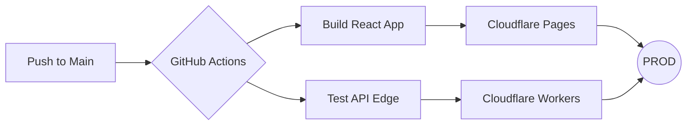

# 💎 FreeLancePay: The Premium Financial Command Center


## 🌌 Overview
**FreeLancePay** is an elite, serverless financial management ecosystem engineered for the modern high-stakes freelancer. It's not just a tool; it's a visual command center that bridges the gap between complex enterprise accounting and fluid user experience.

Built with a **Glassmorphic UI** and powered by **Cloudflare's Edge Infrastructure**, FreeLancePay offers sub-second latency and military-grade security for your financial data.

---

## ✨ Key Features & Experience

| Feature | Description | Aesthetic |
| :--- | :--- | :--- |
| **Intelligence Dashboard** | Real-time financial health monitoring with 6-month predictive modeling. | 🌈 Vibrant Gradients |
| **Smart Billing** | One-tap payment tracking with automated overdue escalation. | ❄️ Frosty Glass |
| **Income Mastery** | Client-centric revenue tracking and tax-ready categorization. | 📈 Sharp Visuals |
| **Security Hub** | Audit logs, session management, and encrypted data vaults. | 🛡️ Cyber-Dark |


---

## 🛠️ Specialized Repository Structure
This repository is meticulously organized into specialized branches for seamless navigation and modular development:

- 🌟 **`main`**: The master integrated platform. Everything you need in one place.
- 🎨 **`frontend`**: Pure React + Vite source code. Optimized for UI/UX developers.
- ⚙️ **`backend`**: Edge-optimized Hono/Worker code. The engine of the application.
- 🚀 **`devops`**: Docker, Kubernetes, and CI/CD configurations.

---

## 🚀 Rapid Deployment Setup

### 📦 Prerequisites
- **Node.js** (v18+)
- **Cloudflare Wrangler** (for Edge functions)
- **Docker** (for containerized local dev)

### 🖱️ One-Command Start
```bash
# Clone the vision
git clone https://github.com/harshit-mehta-lab/FreeLancePayApp.git

# Frontend Ignition
cd client && npm install && npm run dev

# Backend Ignition
cd server && npm install && npx wrangler dev
```

---

## 🛰️ Automated CI/CD Pipeline
FreeLancePay is equipped with high-performance **GitHub Actions** for zero-downtime deployments.



---

## 🛡️ Security First Protocol
- **Zero Secrets Policy**: No hardcoded keys. All environment variables are managed via Cloudflare Secret Management.
- **Edge Sanitization**: Real-time request filtering to prevent injection and XSS.
- **Root Admin Lock**: Critical system functions restricted to verified admin signatures.

---

## 👤 Credits & Author
Crafted with precision by **Antigravity AI** for **Harshit Mehta**.

---
*© 2026 FreeLancePay. All rights reserved. Secure. Fluid. Elite.*
